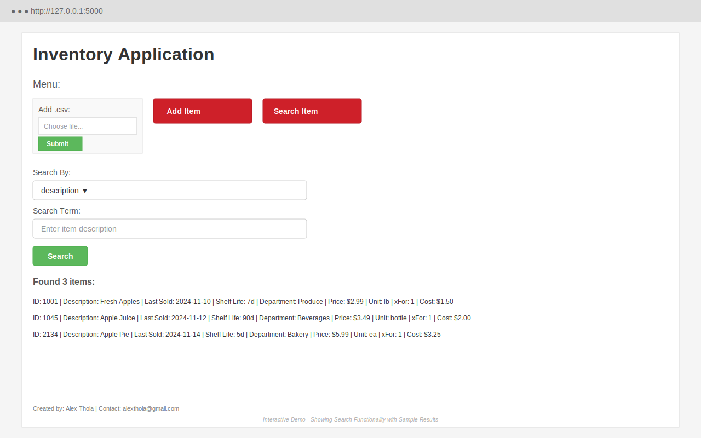

# Backstock
Python application which searches for and updates inventory items in a database

## Technology Stack
- **Python**: 3.11+ (minimum 3.9)
- **Framework**: Flask 3.x
- **Database**: PostgreSQL with SQLAlchemy 2.0
- **Package Manager**: UV (modern, fast Python package manager)

## Setup

### Using UV (Recommended)

This application uses [uv](https://github.com/astral-sh/uv) for fast, reliable dependency management.

1. Install uv (if not already installed):
```bash
pip install uv
```

2. Create virtual environment and install dependencies:
```bash
uv venv
uv pip install -r requirements.txt
```

3. Activate virtual environment:
```bash
source .venv/bin/activate  # On Linux/Mac
# or
.venv\Scripts\activate  # On Windows
```

4. Set up environment variables (copy .env.example to .env and configure):
```bash
cp .env.example .env
# Edit .env with your configuration
```

### Running app:

**Hosted Demo:**
- Live Demo: https://backstock.onrender.com (Render - Free Tier)

**To run locally** (with virtual environment activated):
```bash
python manage.py runserver
```

Or using gunicorn (production-like):
```bash
gunicorn "src.backstock.app:app"
```

The app will run on http://127.0.0.1:5000/

## Interactive Demo

Experience the Backstock App's functionality with the built-in interactive demo powered by Playwright:

```bash
make demo
```

The demo showcases core features including:
- **Search Functionality** - Search inventory items by various criteria (ID, description, department, price, etc.)
- **Add Items** - Add individual items with comprehensive details (ID, description, price, cost, shelf life, etc.)
- **CSV Upload** - Bulk import inventory data from CSV files
- **Navigation** - Intuitive switching between different views and operations

### Demo Options

Customize the demo experience with command-line arguments:

```bash
# Run in headless mode (no browser window)
uv run python demo/demo.py --headless

# Adjust demo speed (slow, normal, or fast)
uv run python demo/demo.py --speed slow

# Capture screenshots during demo
uv run python demo/demo.py --screenshots

# Keep demo database after completion
uv run python demo/demo.py --keep-db

# Use custom port
uv run python demo/demo.py --port 8000

# Combine multiple options
uv run python demo/demo.py --headless --speed fast --screenshots
```

**Screenshots** are saved to `demo_screenshots/` with timestamps for each action.

### What You'll See


*Interactive demo showing the search functionality with sample inventory results. The interface features a clean Bootstrap design with menu buttons for CSV upload, adding items, and searching. The search view displays a dropdown for criteria selection and shows formatted results with complete item details including ID, description, pricing, and inventory metadata.*

The Backstock Application features a clean Bootstrap-based interface with:

1. **Main Menu** - Three primary action buttons:
   - Add .csv (CSV file upload)
   - Add Item (Single item entry form)
   - Search Item (Multi-criteria search)

2. **Search View** - Dropdown selector for search criteria (ID, description, last_sold, shelf_life, department, price, unit, x_for, cost) with results displayed in a formatted list

3. **Add Item Form** - Comprehensive data entry with fields for:
   - ID, Description, Last Sold Date
   - Shelf Life, Department
   - Price, Unit of Measurement
   - xFor (quantity), Cost

4. **Results Display** - Formatted list showing all item details with count of items found

> **Note**: Run `uv run python demo/demo.py --screenshots` to capture your own screenshots of the application interface. The demo includes automated interactions showcasing all major features.

## Database Management

This database uses PostgreSQL with SQLAlchemy 2.0 ORM.

Initialize the database:
```bash
python manage.py db init
```

Create a migration:
```bash
python manage.py db migrate
```

Apply migrations:
```bash
python manage.py db upgrade
```

## PostgreSQL Database Commands

Connect to the database:
```bash
psql -d inventory_dev
```

Or within psql:
```sql
\c inventory_dev
```

List tables:
```sql
\dt
```

Describe table structure:
```sql
\d grocery_items
```

## Deployment

### Render (Recommended - Free Tier)

This application is configured for easy deployment on Render with automatic deployment from GitHub.

**Quick Start:**
1. Create account at [render.com](https://render.com)
2. Connect your GitHub repository
3. Click **New +** → **Blueprint**
4. Select this repository (Render will detect `render.yaml`)
5. Click **Apply** - Render handles the rest!

**Features:**
- Auto-deploy on push to `main` branch
- Free PostgreSQL database (1GB)
- Free SSL certificates
- Automated weekly backups via GitHub Actions

**Important:** Free Render databases expire after 90 days. See the **[Deployment Wiki](wiki/deployment)** for:
- [Complete deployment guide](wiki/deployment/Render-Setup.md)
- [Automated backup configuration](wiki/deployment/Backup-and-Restore.md)
- [90-day database rotation process](wiki/deployment/Database-Rotation.md)
- [Troubleshooting tips](wiki/deployment/Troubleshooting.md)
- [Quick reference](wiki/deployment/Quick-Reference.md)

**Your App URL:** `https://backstock.onrender.com` (or your assigned URL)

## Security Updates

This codebase has been modernized with:
- Updated to Python 3.11+ (from 3.7)
- All dependencies updated to latest secure versions
- Fixed hardcoded SECRET_KEY vulnerability
- Updated to SQLAlchemy 2.0 (from 1.3)
- Updated to Flask 3.x (from 1.1)
- Improved error handling and session management
